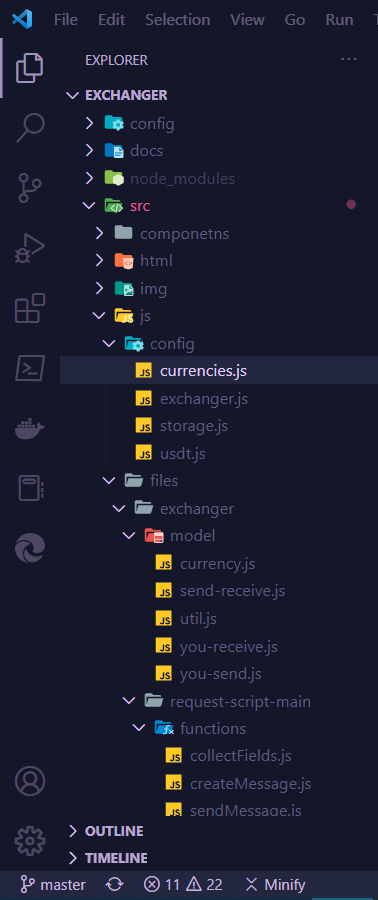

# Project configuration

The Webpack and Gulp configuration files, such as [`gulp-settings.js`](../config/gulp-settings.js) or [`webpack.prod.js`](../config/webpack.prod.js) are placed in `config/` folder.

You might change those if you need to alter the project configuration, but those will not affect the application logic.

The application configuration files are placed in `src/js/config/` folder:

- [`currencies.js`](../src/js/config/currencies.js) defines all information about fiat currencies and cryptocurrencies used in app.

    You might also want to read [Binance API V3 (Spot) Documentation](https://binance-docs.github.io/apidocs/spot/en).

- [`exchanger.js`](../src/js/config/exchanger.js) contains a data for **Exchanger** page logic, including timer duration, exchange fees and data to connect to Telegram.

- [`message.js`](../src/js/config/message.js) contains message templates, used to format message, which is sent to Telegram.

- [`scrollDispatcher.js`](../src/js/config/scrollDispatcher.js) contains configuration for scroll dispatcher. You can control how fast is scroll, when clicking link in header or footer.

- [`storage.js`](../src/js/config/storage.js) contains a token names for `localStorage`, where to store cryptocurrency id between redirect from **Home** page to **Exchanger** page. As a result, cryptocurrency is selected at **Exchanger**.
